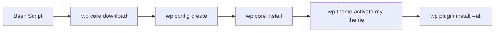

import { Playground } from '@components/Playground'

WP-CLI (WordPress Command Line Interface) — это мощный инструмент, который позволяет управлять сайтом, не заходя в панель управления. Это критически важно для автоматизации, деплоя и быстрой работы профессионального разработчика.

## Основные команды

Команды WP-CLI всегда начинаются с префикса `wp`.

### Управление плагинами и темами

```bash
# Посмотреть список плагинов
wp plugin list

# Установить и активировать плагин
wp plugin install woocommerce --activate

# Обновить все плагины разом
wp plugin update --all

# Удалить тему
wp theme delete twentytwenty
```

### Управление базой данных

```bash
# Экспорт базы данных в файл
wp db export site_backup.sql

# Импорт базы данных
wp db import new_database.sql

# Поиск и замена строк (полезно при смене домена)
wp search-replace 'http://old-site.local' 'https://new-site.com'
```

### Работа с пользователями

```bash
# Создать администратора
wp user create yasha yasha@example.com --role=administrator --user_pass=password123

# Сбросить пароль для пользователя
wp user update 1 --user_pass=new_secure_pass
```

## Автоматизация и скрипты

Вы можете объединять команды в bash-скрипты для быстрой развертки проекта.



## Почему это важно в 2026?

В современной разработке (CI/CD) ручная настройка сайта через админку считается плохой практикой (anti-pattern). Все изменения конфигурации, миграции данных и обновления должны происходить программно. WP-CLI — это мост между WordPress и миром профессиональной DevOps-инженерии.

## Интерактивный пример

Симулятор WP-CLI команд:

<Playground client:visible
  template="static"
  files={{
    "/index.html": {
      code: `<!DOCTYPE html>
<html lang="ru">
<head>
<meta charset="UTF-8">
<style>
* { box-sizing: border-box; margin: 0; padding: 0; }
body { font-family: monospace; background: #0f172a; color: #e2e8f0; padding: 20px; }
h3 { color: #818cf8; margin-bottom: 12px; }
.quick-cmds { display: flex; flex-wrap: wrap; gap: 4px; margin-bottom: 12px; }
.quick-cmds button { background: #1e293b; border: 1px solid #334155; color: #94a3b8; padding: 4px 8px; border-radius: 4px; cursor: pointer; font-size: 10px; font-family: monospace; }
.quick-cmds button:hover { border-color: #818cf8; color: #818cf8; }
.terminal { background: #1e293b; border: 1px solid #334155; border-radius: 10px; padding: 14px; font-size: 12px; max-height: 300px; overflow-y: auto; }
.line { padding: 2px 0; }
.prompt { color: #22c55e; }
.output { color: #94a3b8; }
.success { color: #4ade80; }
.error { color: #f87171; }
.input-row { display: flex; gap: 4px; margin-top: 6px; }
.input-row input { background: transparent; border: none; color: #e2e8f0; font-family: monospace; font-size: 12px; flex: 1; outline: none; }
</style>
</head>
<body>
<h3>WP-CLI Terminal</h3>
<div class="quick-cmds">
  <button onclick="runCmd('wp core version')">wp core version</button>
  <button onclick="runCmd('wp plugin list')">wp plugin list</button>
  <button onclick="runCmd('wp theme list')">wp theme list</button>
  <button onclick="runCmd('wp user list')">wp user list</button>
  <button onclick="runCmd('wp post list')">wp post list</button>
  <button onclick="runCmd('wp db optimize')">wp db optimize</button>
  <button onclick="runCmd('wp cache flush')">wp cache flush</button>
</div>
<div class="terminal" id="term"></div>
<script>
const term = document.getElementById("term");
const commands = {
  "wp core version": { out: "6.4.2", cls: "success" },
  "wp plugin list": { out: "+-------------------+--------+-----------+\\n| name              | status | version   |\\n+-------------------+--------+-----------+\\n| akismet           | active | 5.3       |\\n| woocommerce       | active | 8.4.0     |\\n| yoast-seo         | active | 21.6      |\\n| contact-form-7    | inactive| 5.8      |\\n+-------------------+--------+-----------+", cls: "output" },
  "wp theme list": { out: "+------------------+--------+---------+\\n| name             | status | version |\\n+------------------+--------+---------+\\n| twentytwentyfour | active | 1.0     |\\n| twentytwentythree| inactive| 1.3    |\\n+------------------+--------+---------+", cls: "output" },
  "wp user list": { out: "+----+-------+------------------+------+\\n| ID | login | email            | role |\\n+----+-------+------------------+------+\\n| 1  | admin | admin@site.com   | admin|\\n| 2  | editor| editor@site.com  | editor|\\n+----+-------+------------------+------+", cls: "output" },
  "wp post list": { out: "+----+-----------------------+---------+-------+\\n| ID | title                 | status  | type  |\\n+----+-----------------------+---------+-------+\\n| 1  | Hello World           | publish | post  |\\n| 2  | Sample Page           | publish | page  |\\n| 3  | Privacy Policy        | draft   | page  |\\n+----+-----------------------+---------+-------+", cls: "output" },
  "wp db optimize": { out: "Success: Database optimized.", cls: "success" },
  "wp cache flush": { out: "Success: The cache was flushed.", cls: "success" },
};
function addLine(text, cls) {
  const div = document.createElement("div");
  div.className = "line";
  div.innerHTML = "<span class=\\"" + cls + "\\">" + text + "</span>";
  term.appendChild(div);
  term.scrollTop = term.scrollHeight;
}
function runCmd(cmd) {
  addLine("$ " + cmd, "prompt");
  const result = commands[cmd];
  if (result) {
    result.out.split("\\n").forEach(l => addLine(l, result.cls));
  } else {
    addLine("Error: command not found", "error");
  }
  addInputLine();
}
function addInputLine() {
  const div = document.createElement("div");
  div.className = "input-row";
  div.innerHTML = "<span class=\\"prompt\\">$ </span>";
  const input = document.createElement("input");
  input.placeholder = "Type wp command...";
  input.onkeydown = (e) => { if (e.key === "Enter") { input.disabled = true; runCmd(input.value.trim()); } };
  div.appendChild(input);
  term.appendChild(div);
  input.focus();
}
addLine("WordPress CLI v2.9.0", "output");
addInputLine();
<\/script>
</body>
</html>`,
      active: true,
    },
  }}
/>
